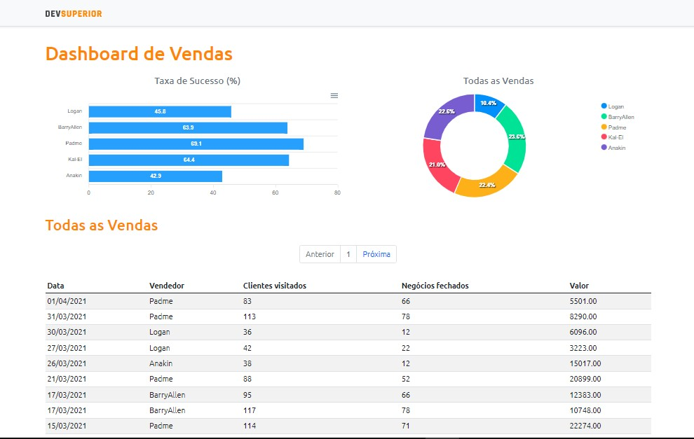

  <h1>Dashboard de Vendas</h1>
  

 

## 💻 Tecnologias Utilizadas
Esse projeto foi desenvolvido com as seguintes tecnologias:
- [ReactJS](https://reactjs.org)
- [Bootstrap](https://getbootstrap.com)
- [TypeScript](https://www.typescriptlang.org/)
- [SpringBoot](https://spring.io/projects/spring-boot)
- [JavaScript](https://developer.mozilla.org/pt-BR/docs/Learn/JavaScript)
- [Postman](https://www.postman.com/downloads/)
- [Heroku](https://dashboard.heroku.com/apps)
- [Postegre SQL](https://www.postgresql.org)
- [Java](https://www.java.com/pt-BR/)
- [Netlify](https://www.netlify.com)

 

## 🌎	[Clique aqui para acessar o site do dashboard](https://dsvendas-thiago-suzuki.netlify.app/dashboard)

 

Feito por Thiago Suzuki na Semana Spring React da DevSuperior
